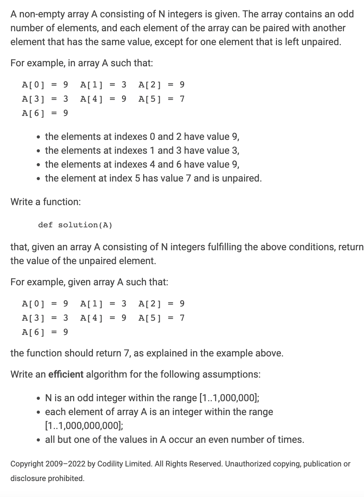

[https://app.codility.com/programmers/lessons/2-arrays/odd\_occurrences\_in\_array/](https://app.codility.com/programmers/lessons/2-arrays/odd_occurrences_in_array/)

배열 A에는 같은 값을 가지는 숫자들이 pair된 상태, 즉 짝수개 존재한다. 하지만 그중 하나의 아이템은 pair되지 않은 값을 가지고 있다. 그 아이템의 값을 찾는 문제다.

---

### 풀이

[https://app.codility.com/demo/results/training2V8WF7-FPQ/](https://app.codility.com/demo/results/training2V8WF7-FPQ/)

오름차순으로 정렬 후, loop를 2 step씩 돌면서 현재 아이템과 다음 아이템이 같은지 비교한다.

1.  배열의 길이가 1일때
2.  A\[i\] 와 A\[i+1\]이 다를때 => pair 된 상태가 아닌 상태의 값을 찾음
3.  i+1이 배열의 길이일때 => 배열 길이가 홀수라는 뜻이고, 2번을 모두 통과 한 상태이므로 마지막 남은 아이템이 Odd상태임

---

### 오답

#### out of range

```python
def solution(A):
    if len(A) == 1: 
        return A[0]

    A = sorted(A)

    for i in range(0, len(A), 2):
        if A[i] != A[i + 1] or (i + 1) == len(A):
            return A[i]
```

[https://app.codility.com/demo/results/trainingAN7S3E-H4R/](https://app.codility.com/demo/results/trainingAN7S3E-H4R/)

`A[i] != A[i+1]` 조건이 먼저 오게되어 out of range 오류가 발생했다.

#### 효율성 실패

```python
def solution(A):
    if len(A) == 1:
        return A[0]
    
    stack = list(set(A))

    for i in range(len(stack)):
        if A.count(stack[i]) % 2 == 1:
            return stack[i]
```

[https://app.codility.com/demo/results/trainingMC6B2P-59G/](https://app.codility.com/demo/results/trainingMC6B2P-59G/)

Set을 통해 중복 값을 가지는 아이템을 제거한 배열 stack을 만들고 루프를 돌린다. stack\[i\] 값이 배열 A에 짝수개 존재하는지 카운팅하고 홀수면 그 값을 반환한다.

O(N²) 시간복잡도를 가지는 알고리즘이다. 가급적 중첩 루프를 사용하는 방식은 하지 않는게 좋을것같다.

---

### 리뷰

좀 더 꼼꼼히 로직을 생각하고 확인하며, 시간복잡도를 생각하며 구현하자
