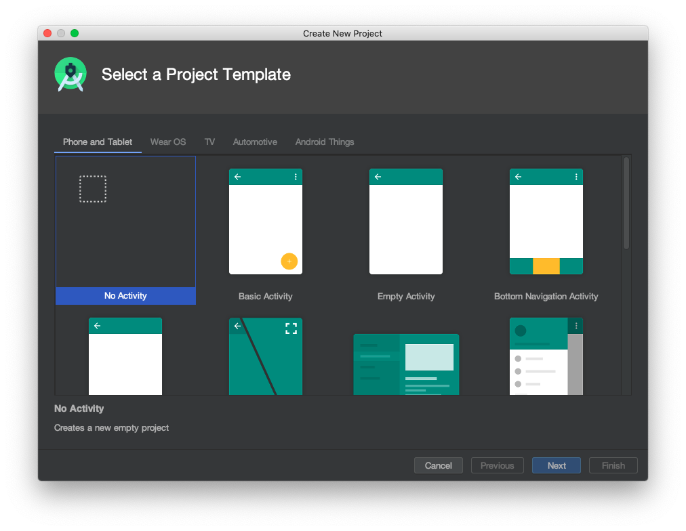
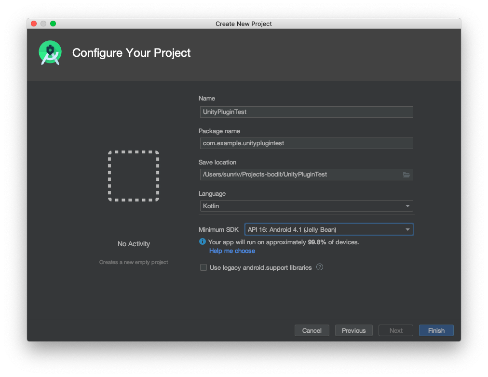
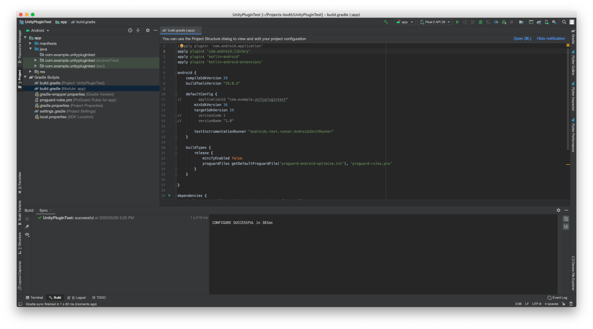
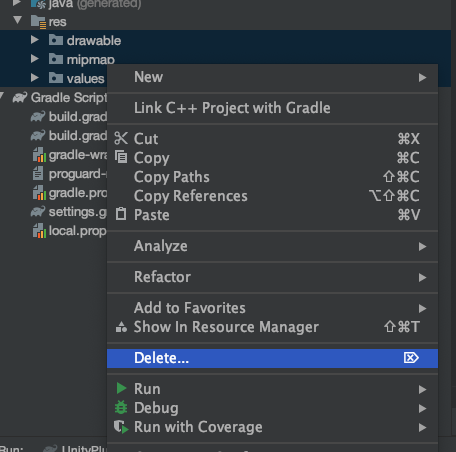
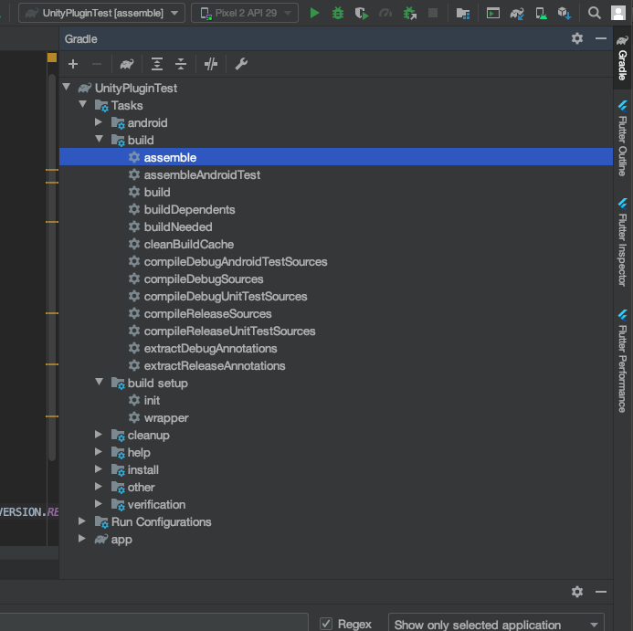
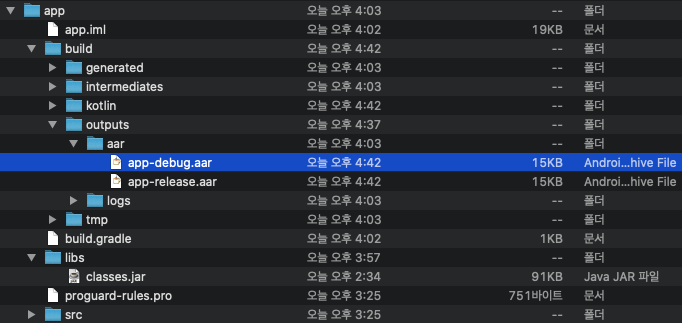

> 이 글은 아래 버전 기준으로 작성되었습니다.
> 
> - Unity: 2018.4.19f  
> - Android Studio: 3.6.3  
> - JDK: OpenJDK "1.8.0_242"

유니티용 안드로이드 플러그인을 만드는 방법은 다양하게 있지만 여기서는 대표적인 AAR(**A**ndroid **AR**chive)을 사용하는 방법으로 진행하겠습니다.


## 설치

아래 링크에서 유니티와 안드로이드 스튜디오를 다운로드 및 설치해주세요

유니티: [https://unity3d.com/get-unity/update](https://unity3d.com/get-unity/update)  
안드로이드 스튜디오: [https://developer.android.com/studio](https://developer.android.com/studio)

---

## 안드로이드 프로젝트 생성

먼저 안드로이드 스튜디오에서 프로젝트를 하나 생성해줍니다.

Activity는 필요없으므로 No Activity를 선택하고



프로젝트 이름과 Package Name, 언어 등을 설정해주세요.




## 안드로이드 프로젝트 설정



`com.unity3d.player.UnityPlayer` 패키지 사용을 위해 Unity에 있는 `classes.jar`파일을 안드로이드 플러그인 프로젝트의 `app/libs` 폴더에 복사해줍니다

`classes.jar` 파일의 경로는 맥 기준으로 다음과 같습니다.

```shell
/Applications/Unity/Hub/Editor/2018.4.19f1/PlaybackEngines/AndroidPlayer/Variations/il2cpp/Release/Classes/classes.jar
```


`app` 모듈의 `build.gradle` 파일을 수정해줍니다.

-   com.android.**application** 을 com.android.**library**로 수정합니다.
-   `applicationId`, `versionCode`, `versionName`은 필요없으므로 모두 주석처리 또는 지워줍니다.
-   dependencies 에서 libs 폴더에있는 `classes.jar`파일 불러오는 부분을 `implementation` -> `compileOnly`로 수정합니다.  
    이는 `.aar`파일로 빌드할때 `app/libs`폴더에 복사했던 `unity-classes.jar`파일을 제외하기 위함입니다. 이 파일이 포함되면 유니티에서 빌드할때 충돌이 나게 됩니다.

```gradle
// apply plugin: 'com.android.application'
apply plugin: 'com.android.library'

android {
    ...

    defaultConfig { 
        ...

        //applicationId "com.example.unityplugintest"
        //versionCode 1
        //versionName "1.0"
    }
}

dependencies {
    ...

    // implementation fileTree(dir: 'libs', include: ['*.jar'])
    compileOnly fileTree(dir: 'libs', include: ['*.jar'])

    ...
}
```

`AndroidManifest.xml` 파일에서 `application`을 지웁니다.

충돌 예방 차원에서 `res/drawable`, `res/mipmap`, `res/values` 등등 `res/..` 하위 폴더를 다 지웁니다.



유니티 프로젝트의 C#스크립트에서 Call 할 수 있는 메소드들이 정의된 `UnityPluginTestClass.java` 파일을 안드로이드 프로젝트에 생성합니다.

```cs
package com.example.unityplugintest;

import android.content.Context;
import android.os.Build;
import android.widget.Toast;

import com.unity3d.player.UnityPlayer;

public class UnityPluginTestClass {
    private static UnityPluginTestClass m_instance;
    private Context context;

    public static UnityPluginTestClass instance() {
        if (m_instance == null) {
            m_instance = new UnityPluginTestClass();
        }
        return m_instance;
    }

    private void setContext(Context context) {
        this.context = context;
    }

    private void ShowToast(String toastStr) {
        Toast.makeText(this.context, toastStr, Toast.LENGTH_LONG).show();
    }

    private void AndroidVersionCheck(String objName, String objMethod){
        UnityPlayer.UnitySendMessage(objName, objMethod, "My Android Version: " + Build.VERSION.RELEASE);
    }
}
```

우측상단의 Gradle을 클릭하여 `[projectname]/Tasks/build/assemble`을 더블클릭하여 실행하면 `app/build/outputs/aar/app-debug.aar`파일이 만들어집니다.





## 유니티 프로젝트 설정

다음으로 유니티 프로젝트에서 해야할 작업들입니다.

프로젝트 아무곳에다가 `UnityPluginTest.cs` 파일을 생성합니다.

```cs
using System.Collections;
using System.Collections.Generic;
using UnityEngine;

public class UnityPluginTest : MonoBehaviour
{

    private AndroidJavaObject activityContext = null;
    private AndroidJavaClass javaClass = null;
    private AndroidJavaObject javaClassInstance = null;

    void Awake()
    {

        //일단 아까 plugin의 context를 설정해주기 위해
        //유니티 자체의 UnityPlayerActivity를 가져옵시다.
        using (AndroidJavaClass activityClass = new AndroidJavaClass("com.unity3d.player.UnityPlayer"))
        {
            activityContext = activityClass.GetStatic<AndroidJavaObject>("currentActivity");
            
        }

        //클래스를 불러와줍니다.
        //패키지명 + 클래스명입니다.
        using (javaClass = new AndroidJavaClass("com.example.unityplugintest.UnityPluginTestClass"))
        {
            if (javaClass != null)
            {
                //아까 싱글톤으로 사용하자고 만들었던 static instance를 불러와줍니다.
                javaClassInstance = javaClass.CallStatic<AndroidJavaObject>("instance");
                //Context를 설정해줍니다.
                javaClassInstance.Call("setContext", activityContext);
            }
        }
    }

    public void CallShowToast()
    {
        //Toast는 안드로이드의 UiThread를 사용하기때문에 
        //UnityPlayerActivity UiThread를 호출하고, 다시 ShowToast를 호출합니다.

        //UiThread에서 호출하지 않으면 Looper.prepare()어쩌고 에러가 뜨는데..
        //제대로 이해하지 못했습니다.. 누가 설명좀해줘요.
        activityContext.Call("runOnUiThread", new AndroidJavaRunnable(() =>
        {
            javaClassInstance.Call("ShowToast", "Hello world!!");
        }));
    }

    public void CallAndroidVersionCheck()
    {

        //아까 JavaClass에서 인수로 받아 넣던
        //objName과 objMethod의 정체입니다.
        //objName은 Scene내의 GameObject의 이름입니다 (ex)gameobject.transform.name)
        //objMethod는 GameObject에 SendMessage할 메소드명입니다.
        object[] tmpObj = new object[2];
        tmpObj[0] = "AndroidManager";
        tmpObj[1] = "AndroidLog";

        //불러봅시다.
        javaClassInstance.Call("AndroidVersionCheck", tmpObj);
    }


    // tmpObj[1] = "AndroidLog";
    // 요기서 설정한 메소드명입니다.
    public void AndroidLog(string str)
    {
        Debug.Log(str);
    }
}
```

`Assets/Plugins/Android/` 디렉토리에 아까 안드로이드 프로젝트에서 생성한 `app-debug.aar` 파일을 복사하여 붙여넣습니다.


이제 빌드하면 apk 파일이 생성될텐데 이 파일을 AVD나 안드로이드폰에 설치하여 테스트를 진행합니다.

---

## Git

### Unity Project

[https://github.com/heyask/MyUnityPlugin-unity](https://github.com/heyask/MyUnityPlugin-unity)

### Android Project

[https://github.com/heyask/MyUnityPlugin-android](https://github.com/heyask/MyUnityPlugin-android)