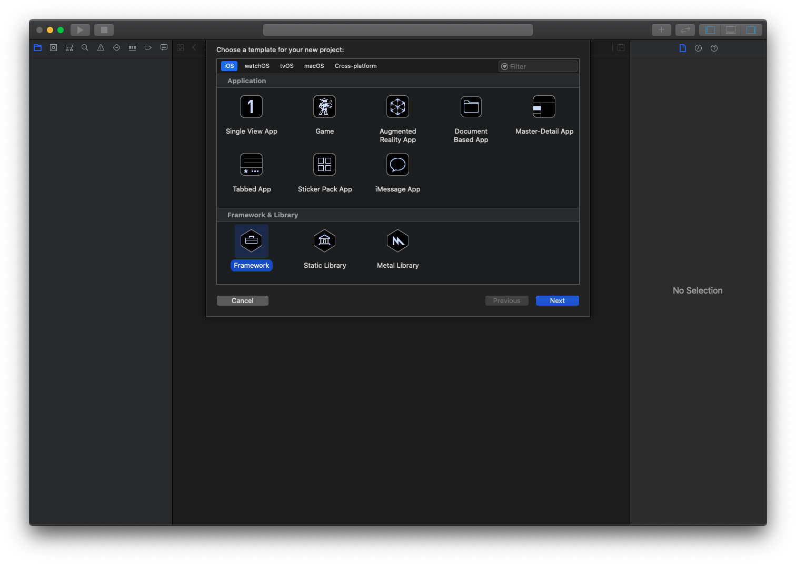
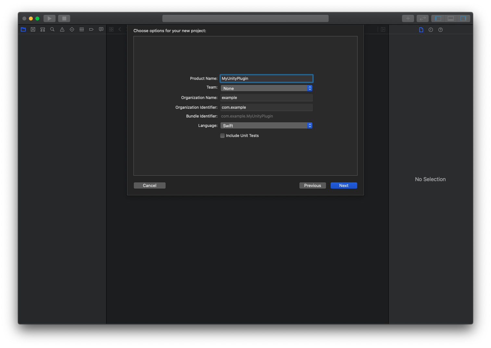
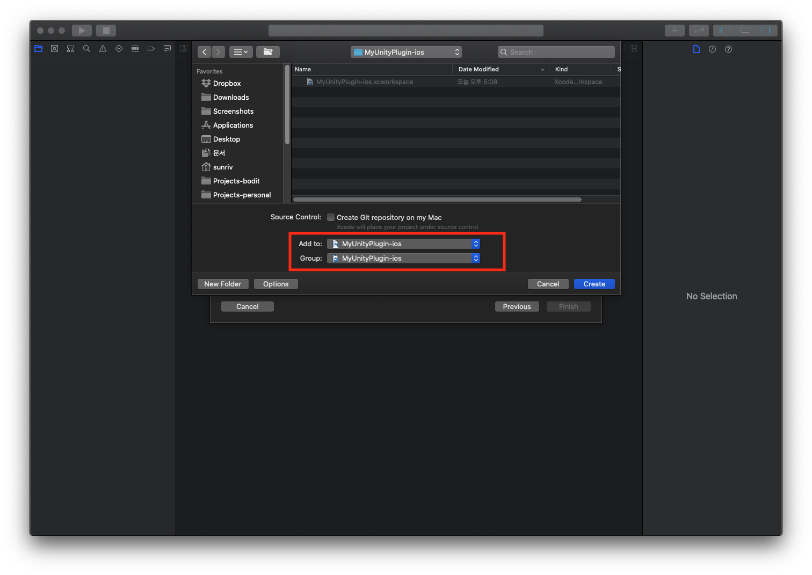
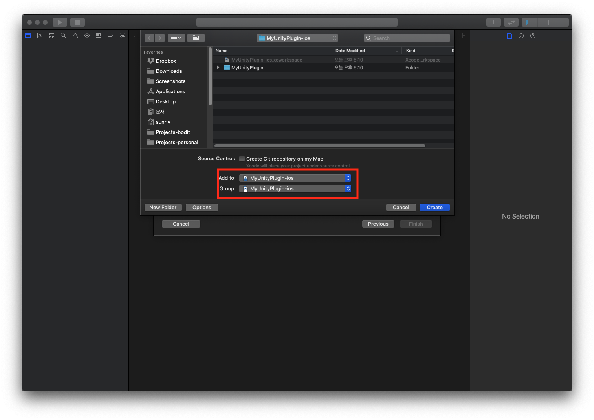
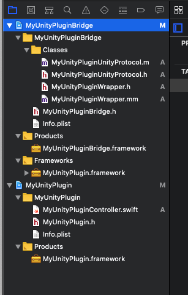
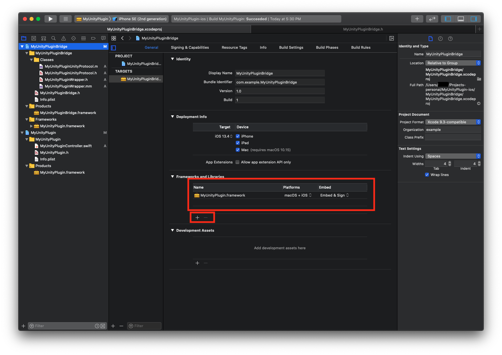
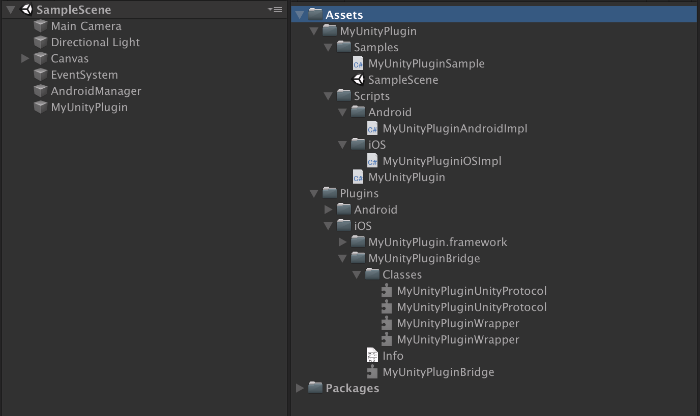

> 이 글은 아래 버전 기준으로 작성되었습니다.
> 
> - Unity: 2018.4.19f  
> - Xcode: 11.4.1 (11E503a)

유니티용 iOS 플러그인은 기본적으로 Objective-C만 지원이 됩니다. 하지만 브릿지를 통해 인터페이스만 Objective-C로 작성하고 Swift로 실구현내용을 작성하는 방식을 통해 유니티 플러그인을 만들 수 있습니다.

## 설치

유니티가 설치되어있지 않으면 먼저 설치해줍니다.

유니티: [https://unity3d.com/get-unity/update](https://unity3d.com/get-unity/update)  
Xcode: 맥 앱스토어에서 설치할 수 있습니다. [https://apps.apple.com/kr/app/xcode/id497799835?mt=12](https://apps.apple.com/kr/app/xcode/id497799835?mt=12)

---

## Workspace 생성

두개의 프로젝트를 생성할 것이므로 Xcode에서 workspace를 생성해줍니다. Xcode를 실행하고 상단 메뉴에서 File-New-Workspace를 선택하여 생성합니다.

### Xcode Project 생성

마찬가지로 File-New-Project를 클릭하여 두개의 프로젝트를 생성해줍니다. 템플릿은 Framework를 선택하고 하나는 언어를 Swift로 다른 한개의 프로젝트는 Objective-C로 설정합니다.

프로젝트 생성시 “Add to”와 “Group” 은 workspace로 설정합니다.

### Swift 프로젝트 생성

### Objective-C Bridge 프로젝트 생성

## 프로젝트 구조

`MyUnityPluginBridge` Objective-C로 작성된 브리지 프로젝트. 인터페이스 역할을 합니다.
- `MyUnityPluginUnityProtocol.m` 유니티로 콜백 이벤트를 보내기 위한 프로토콜들을 모아놓은 파일입니다.  
- `MyUnityPluginWrapper.mm` 유니티에서 호출할 수 있는 ios native 메소드들(MyUnityPlugin swift 프로젝트에 정의된)을 호출하는 브리지 인터페이스를 모아놓은 파일입니다. MyUnityPluginWrapper.mm 파일에는 extern “C”를 통해 함수 노출을 해야하므로 확장자를 .mm으로 변경해줍니다.

`MyUnityPlugin`: Swift로 작성된 실 구현 코드를 작성할 프로젝트  
- `MyUnityPluginController.swift`: MyUnityPluginWrapper에서 호출되는, 실제 수행하는 코드가 담겨있는 swift 파일입니다.

> 프로젝트 전체 코드는 맨 아래에 Github 링크가 있습니다.

이렇게 프로젝트를 생성하고 MyUnityPlugin 프로젝트를 Build하면 `MyUnityPlugin.framework`파일이 생성됩니다. (Build시 Target을 ios simulator로 하면 안됩니다!)

`MyUnityPluginBridge` 프로젝트를 선택하여 General-Frameworks and Libraries에 `MyUnityPlugin.framework`를 추가해줍니다.

## 유니티 Project 생성

유니티 프로젝트의 구조는 다음과 같습니다.

Assets/MyUnityPlugin/`Samples`: 샘플 씬과 스크립트가 들어있는 디렉토리

Assets/MyUnityPlugin/Scripts/iOS/`MyUnityPluginiOSImpl.cs`: MyUnityPlugin.cs에서 Android, iOS 각 플랫폼의 함수 호출을 맵핑하기 위한 Implements 클래스입니다.  

Assets/MyUnityPlugin/Scripts/`MyUnityPlugin.cs`: 샘플 스크립트(즉, 이 플러그인을 사용하는 클라이언트가 싱글톤 instance에 접근하여 메소드를 호출하는 클래스입니다.

Assets/Plugins/iOS/`MyUnityPlugin.framework`: 아까 생성한 swift 프로젝트를 빌드하여 생성된 .framework파일 입니다. 복사하여 이 디렉토리에 붙여넣습니다.

Assets/Plugins/iOS/`MyUnityPluginBridge`: Objective-C로 작성된 브리지 프로젝트입니다. 이 프로젝트의 파일를 그대로 붙여넣습니다.

이제 `Samples` 디렉토리에 있는 `SampleScene`을 열고 유니티 상단메뉴에서 `File -> Build Settings -> iOS 선택 -> Build`를 누르면 xcode프로젝트가 생성됩니다.

---

## Git

#### Unity Project

[https://github.com/heyask/MyUnityPlugin-unity](https://github.com/heyask/MyUnityPlugin-unity)

#### iOS Project

[https://github.com/heyask/MyUnityPlugin-ios](https://github.com/heyask/MyUnityPlugin-ios)
