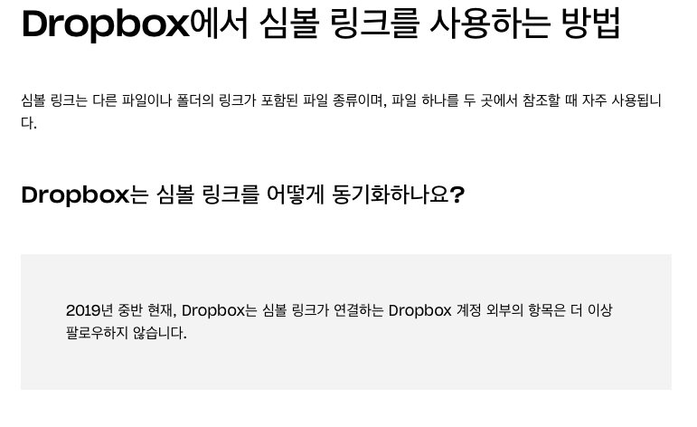
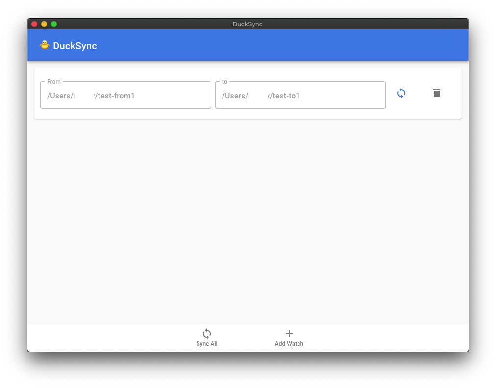

드롭박스가 더 이상 Symbolic Link를 지원하지 않는다고 한다.


*[https://help.dropbox.com/ko-kr/installs-integrations/sync-uploads/symlinks](https://help.dropbox.com/ko-kr/installs-integrations/sync-uploads/symlinks)*

사실 드롭박스에서는 Symbolic Link라는 개념이 없어서 소프트링크가 존재하면 링크가 아니라 그냥 폴더로 인식한다고 한다. 따라서 드롭박스폴더 내에 실제 데이터를 담은 폴더가 있고 해당 폴더를 소프트링크로 생성하면 같은 데이터가 두개가 되고 용량을 두배로 잡아먹게 된다.

장점이 될 수 도있고 단점이 될 수 도 있는데, 나는 이것을 아래와 같이 장점으로 활용했다.

1.  데이터 폴더(A)는 드롭박스 동기화 폴더 밖 어딘가에 위치하고 있다.
2.  A를 드롭박스에 동기화 시키고 싶다.
3.  그런데 A폴더를 드롭박스 동기화 폴더에 이동시켜 넣자니 하드의 용량이 부족하다거나 기타 이유로 그렇게 하고 싶지 않다.
4.  그렇다면 소프트링크를 걸어주면 된다. 이렇게!

```shell
ln -s /path/to/original-directory /path/to/Dropbox/my-soft-link
```

이렇게 하는 이유는 용량 때문이다. 내 맥미니는 512GB SSD를 사용한다. 충분하다고 생각하는 사람도 있겠지만 나에게는 턱없이 부족한 용량이다. 데이터 백업용으로만 4TB 하드 2개를 외장으로 사용중이기 때문이다.

그리고 혹시나 하드가 뻑이나서 데이터가 다 날아가버리는 사태를 방지하기 위해 2중 백업을 하고 있다. 그런데도 불안하다. 신뢰하던 하드가 뻑나서 데이터를 다 날려버린 경험이 있기 때문에..

드롭박스 유료플랜의 가장 낮은 옵션인 Plus만 하더라도 2TB라는 용량을 제공한다. 나는 현재 2TB의 15%정도 밖에 사용하지 않고있다. 사실 드롭박스를 쓰는 이유가 주로 프로젝트 파일이 어떠한 이유로 날아가버리는것에 대비하기 위함이기 때문에 그렇게 큰 용량이 필요하지는 않기 때문이다. 구글 드라이브처럼 100GB, 200GB 옵션도 있으면 좋겠지만 드롭박스측에서 운영 비용상의 이유로 그렇게 하지 못한다고 한다. 버전 관리가 좋기로 유명한 갓드롭박스이니 괜찮다.

어쨋든 나는 드롭박스 동기화 폴더를 외장하드에 연결시켜놓고, 프로젝트 폴더는 수정이 자주 일어나므로 맥의 사용자폴더에 두고있다. 그리고 심볼릭링크를 사용해 프로젝트폴더를 드롭박스에 링크를 생성해놓으면 알아서 드롭박스에 동기화가 되"었"었다.

이 방식의 장점은

첫번째, 자주 사용하는 파일들은 SSD에 놓고 쓰므로 빠르고 자주 사용하지 않는 백업용 파일들은 외장하드에 둘 수 있다. 그럼에도 동기화는 동시에 된다.

두번째, 링크만 해놓으면 드롭박스가 서버에 동기화(백업)을 해놓고 내 컴퓨터에서는 용량을 두배로 잡아먹지 않는다. 무슨 말이냐면 A드라이브에 실제 데이터폴더가 있고 B드라이브에 위치한 드롭박스 폴더안에 A드라이브의 소프트링크를 생성해놓아도 B드라이브에 해당 데이터만큼의 용량을 차지하지 않는다는것이다.

아무튼 매우 좋은 기능이었는데.. 이제 옛날일이 되어버렸다.

그래서 데스크톱용 동기화앱을 만들었다. 이름은 **DuckSync**(오리 동기화. 아무 의미 없다..)




## Github

[https://github.com/aivesoft/DuckSync](https://github.com/aivesoft/DuckSync)

#### Homepage

[https://aivesoft.com/DuckSync](https://aivesoft.com/DuckSync)

#### Download (Mac)

[https://github.com/aivesoft/DuckSync/releases/latest/download/DuckSync.dmg](https://github.com/aivesoft/DuckSync/releases/latest/download/DuckSync.dmg)

현재 맥에서만 테스트 하였고 윈도우나 리눅스에서는 확인해보지 않았다.

앱 자체는 매우 단순하고 사용법도 매우 간단하다.

A 디렉토리와 B 디렉토리를 설정하면 앱이 실행되는동안 A디렉토리의 파일 수정, 추가, 삭제가 일어나는지 감시(Watch)한다. 그리고 해당 이벤트가 발생하면 A디렉토리를 B디렉토리에 동기화하게 된다.

심볼릭링크를 사용하였을때는 B디렉토리에 링크만 생성하면 되었으므로 용량을 차지하지 않았지만 이 앱은 실제 파일 복사를 실시간으로 하기 때문에 용량은 차지한다. 디렉토리는 하드링크가 되지 않는걸..

아무튼 필요하신 분들이 있으면 한번 사용해보세요!
